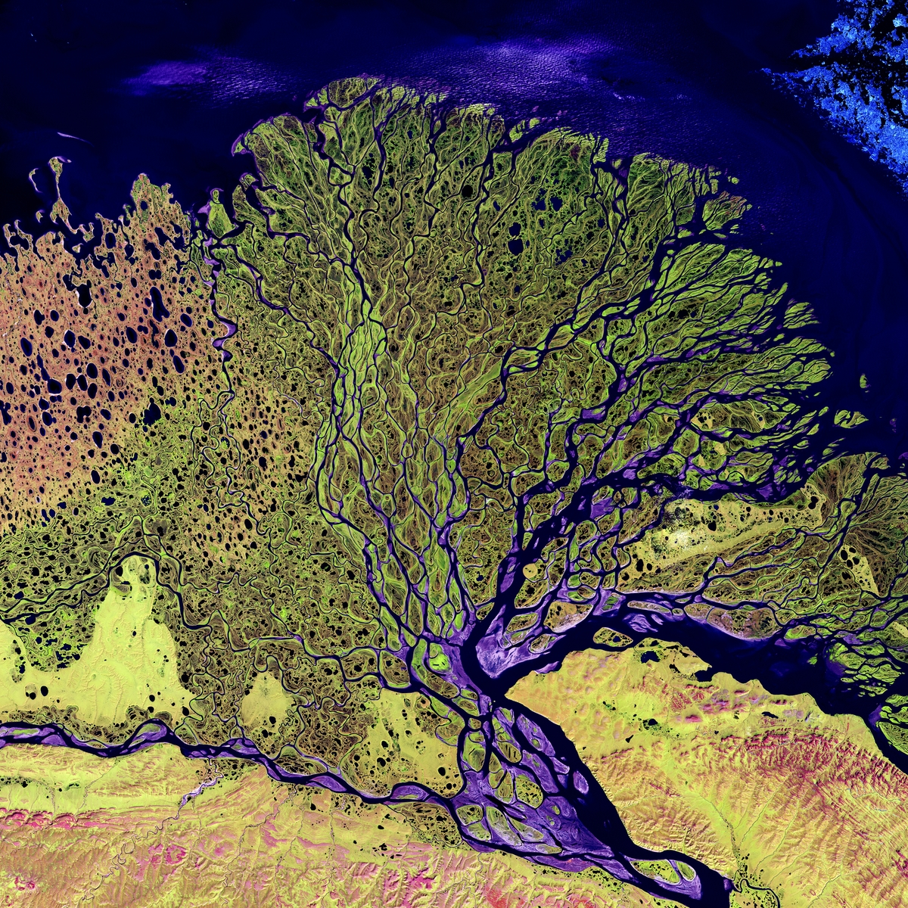
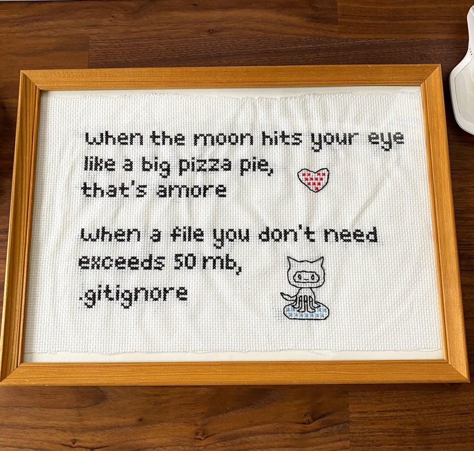
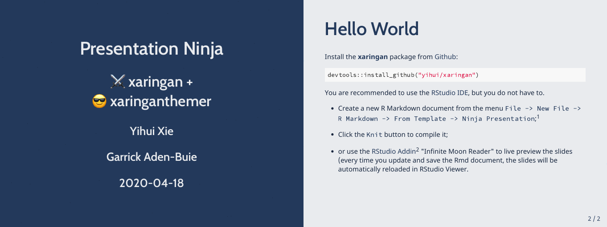
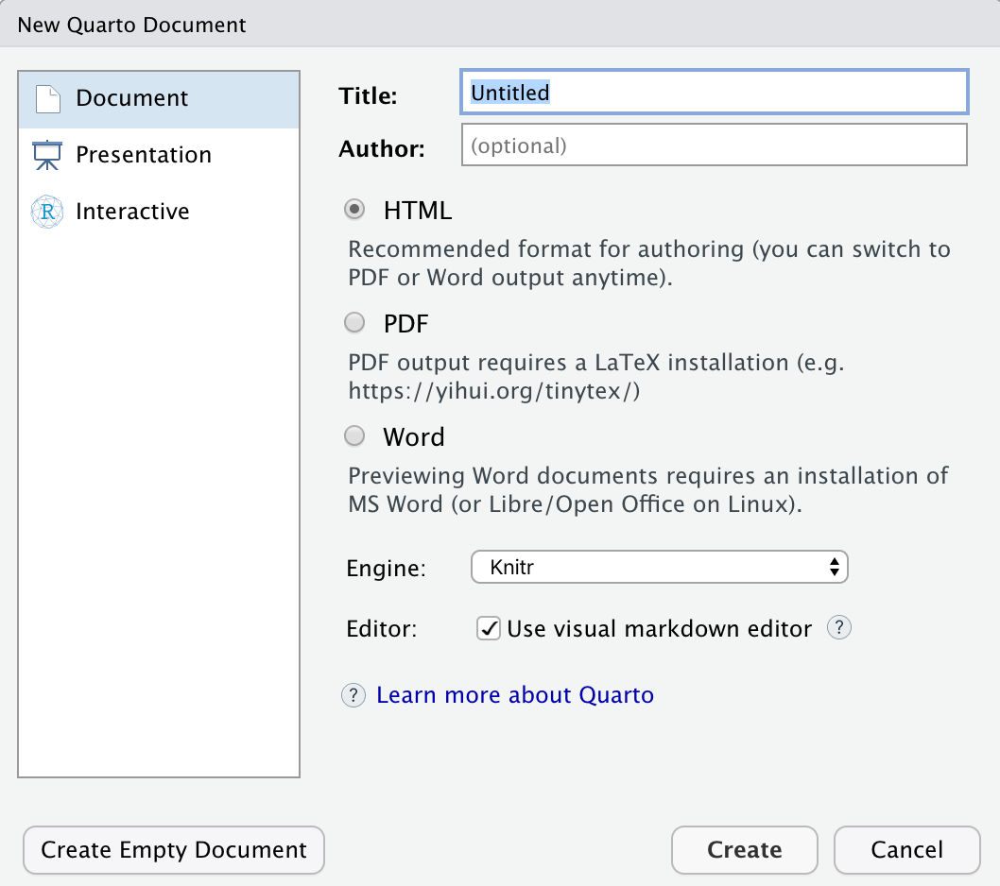

```{r setup, include=FALSE}
options(htmltools.dir.version = FALSE)
```

```{r xaringan-all, echo=FALSE, warning=FALSE}
library(countdown)
library(xaringan)
library(xaringanExtra)
library(knitr)

hook_source <- knitr::knit_hooks$get('source')
knitr::knit_hooks$set(source = function(x, options) {
  x <- stringr::str_replace(x, "^[[:blank:]]?([^*].+?)[[:blank:]]*#<<[[:blank:]]*$", "*\\1")
  hook_source(x, options)
})

xaringanExtra::use_broadcast()
xaringanExtra::use_freezeframe()
xaringanExtra::use_scribble()
#xaringanExtra::use_slide_tone()
xaringanExtra::use_search(show_icon = TRUE, auto_search	=FALSE)
xaringanExtra::use_freezeframe()
xaringanExtra::use_clipboard()
xaringanExtra::use_tile_view()
xaringanExtra::use_panelset()
xaringanExtra::use_editable(expires = 1)
xaringanExtra::use_fit_screen()
xaringanExtra::use_extra_styles(
  hover_code_line = TRUE,         
  mute_unhighlighted_code = TRUE  
)

```

class: center, title-slide, middle

background-image: url("img/CASA_Logo_no_text_trans_17.png")
background-size: cover
background-position: center


<style>
.title-slide .remark-slide-number {
  display: none;
}
</style>

```{r load_packages, message=FALSE, warning=FALSE, include=FALSE}
library(fontawesome)
```

# Remotely Sensing Cities and Environments

### Lecture 2: Portfolio tools: Xaringan and Quarto

### 02/02/2022 (updated: `r format(Sys.time(), "%d/%m/%Y")`)

`r fa("paper-plane", fill = "#562457")` [a.maclachlan@ucl.ac.uk](mailto:a.maclachlan@ucl.ac.uk)
`r fa("twitter", fill = "#562457")` [andymaclachlan](https://twitter.com/andymaclachlan)
`r fa("github", fill = "#562457")` [andrewmaclachlan](https://github.com/andrewmaclachlan)
`r fa("location-dot", fill = "#562457")` [Centre for Advanced Spatial Analysis, UCL](https://www.ucl.ac.uk/bartlett/casa/)
`r fa("file-pdf", fill = "#562457")` [PDF presentation](https://github.com/andrewmaclachlan/CASA0023-lecture-2/blob/main/index.pdf)

<a href="https://github.com/andrewmaclachlan" class="github-corner" aria-label="View source on GitHub"><svg width="80" height="80" viewBox="0 0 250 250" style="fill:#fff; color:#151513; position: absolute; top: 0; border: 0; left: 0; transform: scale(-1, 1);" aria-hidden="true"><path d="M0,0 L115,115 L130,115 L142,142 L250,250 L250,0 Z"></path><path d="M128.3,109.0 C113.8,99.7 119.0,89.6 119.0,89.6 C122.0,82.7 120.5,78.6 120.5,78.6 C119.2,72.0 123.4,76.3 123.4,76.3 C127.3,80.9 125.5,87.3 125.5,87.3 C122.9,97.6 130.6,101.9 134.4,103.2" fill="#562457" style="transform-origin: 130px 106px;" class="octo-arm"></path><path d="M115.0,115.0 C114.9,115.1 118.7,116.5 119.8,115.4 L133.7,101.6 C136.9,99.2 139.9,98.4 142.2,98.6 C133.8,88.0 127.5,74.4 143.8,58.0 C148.5,53.4 154.0,51.2 159.7,51.0 C160.3,49.4 163.2,43.6 171.4,40.1 C171.4,40.1 176.1,42.5 178.8,56.2 C183.1,58.6 187.2,61.8 190.9,65.4 C194.5,69.0 197.7,73.2 200.1,77.6 C213.8,80.2 216.3,84.9 216.3,84.9 C212.7,93.1 206.9,96.0 205.4,96.6 C205.1,102.4 203.0,107.8 198.3,112.5 C181.9,128.9 168.3,122.5 157.7,114.1 C157.9,116.9 156.7,120.9 152.7,124.9 L141.0,136.5 C139.8,137.7 141.6,141.9 141.8,141.8 Z" fill="#562457" class="octo-body"></path></svg></a><style>.github-corner:hover .octo-arm{animation:octocat-wave 560ms ease-in-out}@keyframes octocat-wave{0%,100%{transform:rotate(0)}20%,60%{transform:rotate(-25deg)}40%,80%{transform:rotate(10deg)}}@media (max-width:500px){.github-corner:hover .octo-arm{animation:none}.github-corner .octo-arm{animation:octocat-wave 560ms ease-in-out}}</style>


---

class: inverse, center, middle

```{r, echo=FALSE}
xaringanExtra::use_progress_bar(color = "#0051BA", location = "bottom")
```

# This lecture and practical are solely about getting started with the two data science tools we will use `r emo::ji("book")`

# 1. Xaringan for group presentations*

# 2. Quarto for individual portofios 

---

# How to use the lectures

- Slides are made with [xaringan](https://slides.yihui.org/xaringan/#1)

- `r fa("magnifying-glass")` In the bottom left there is a search tool which will search all content of presentation

- Control + F will also search 

- Press enter to move to the next result 

- `r fa("pencil")` In the top right let's you draw on the slides, although these aren't saved.

- Pressing the letter `o` (for overview) will allow you to see an overview of the whole presentation and go to a slide

- Alternatively just typing the slide number e.g. 10 on the website will take you to that slide

- Pressing alt+F will fit the slide to the screen, this is useful if you have resized the window and have another open - side by side. 

---

# Why are you doing this?

.pull-left[
* Employers want to know you can do data science --- this will let you **show** them as opposed to just telling them. 

* Once you get set up it's actually fairly easy to use, the setup is the hardest part. 

* Collaborating via Git and GitHub is an essential skill that is difficult to learn outside a team setting. 

* I want you to have a Portfolio of some of your work. 

* Let's you show and run code in a presentation.
]

.pull-right[

```{r echo=FALSE, out.width='100%'}

```

.small[Mariner-C Spacecraft Model. Source:[Original from NASA. Digitally enhanced by rawpixel.](https://www.rawpixel.com/image/441650/free-photo-image-astronaut-nasa-satellite)
]
]

---

# Sessions this week

* A bit different....

### First part

* 30 minutes of going through Xaringan
* 30 minutes + homework of you creating a **small** presentation
* This will be part of the assessment this week

--

### Second part

* 30 minutes of going through Quarto
* 30 minutes + creating a Quarto site
* This forms the template for the main assessment component of the module

--

### By the end of the week you'll have an online portfolio! 

---

class: inverse, center, middle


# `r emo::ji("speak")` Xaringan = shar-in-gen or [ʃæ.ˈriŋ.gæn]..
---
class: center, middle

#  Xaringan = shar-in-gen

```{r echo=FALSE, out.width='75%'}

```

.small[Strongest Sharingan of the List | Ninja World. [Source:Pintrest](https://www.pinterest.co.uk/pin/list-of-strongest-all-sharingan--599189925413641687/)
]


---
class: inverse, center, middle


# A lot of the concepts covered today are the same for both Xaringan and Quarto

---

```{r xaringan-logo, echo=FALSE}
xaringanExtra::use_logo(
  image_url = "img/casa_logo.jpg",
  width = "50px",
  position = xaringanExtra::css_position(top = "1em", right = "2em")
)
```

# Xaringan 

This presentation provides **an outline of the tools**...some more information is provided in the practical.

* `r emo::ji("speak")` Xaringan = shar-in-gen or [ʃæ.ˈriŋ.gæn]..

* Created by Yihui Xie....also created Bookdown...

* Install the package from GitHub

* You may also need the remotes package

```{r, eval=FALSE, message=FALSE}
remotes::install_github("yihui/xaringan")
```

* In RStudio: 
  * Make a new project
  * File -> New File -> R Markdown -> From Template -> Ninja Presentation
---

# Xaringan 2

* Make a new project > click Knit

```{r echo=FALSE, out.width='75%', fig.align='center'}

```

---

class: inverse, center, middle
# Don't panic

---

# Start at the top

```{r, eval=FALSE}
---
title: "Presentation Ninja"
subtitle: "⚔<br/>with xaringan"
author: "Yihui Xie"
institute: "RStudio, PBC"
date: "2016/12/12 (updated: `r Sys.Date()`)"
output:
  xaringan::moon_reader: # output format
    lib_dir: libs #used for dependent libraries 
    nature:
      highlightStyle:  # how the code displays
      highlightLines: true 
      countIncrementalSlides: false
      #ratio "16:9" # or 4:3
---
```

* [Highlight options](https://github.com/gnab/remark/wiki/Configuration): arta, ascetic, dark, default, far, github, googlecode, idea, ir-black, magula, monokai, rainbow, solarized-dark, solarized-light, sunburst, tomorrow, tomorrow-night-blue, tomorrow-night-bright, tomorrow-night, tomorrow-night-eighties, vs, zenburn.

???

---

# Writing slides

There are two "types" of slide.

Each slide is separated by a ---, this denotes a new slide 

* A normal slide (like this one) is just...

```{r, eval=FALSE}
---

# Writing slides

There are two "types" of slide.

```

* An inverse slide (the ones with just words on and the blue background)...example on next slide

```{r, eval=FALSE}
---
class: inverse, center, middle

# Writing slides

There are two "types" of slide.
```

---
class: inverse, center, middle

# Writing slides

There are two "types" of slide.

---
class: inverse, center, middle

# Inverse slides are useful for breaking up slides with text and making a specific point

---

class: center, middle

# If you don't use inverse you just get a white (or other, depending on your colourscheme) background...

```{r, eval=FALSE}
class: center, middle

# If you don't use inverse you just get a white (or other, depending on your colourscheme) background...
```
---

# Slide tools

```{r, eval=FALSE}
# Slide tools

```
## Sub heading

```{r, eval=FALSE}
## Sub heading
```
### sub sub heading

```{r, eval=FALSE}
### sub sub heading
```

* Bullet point
  * Sub bullet point

```{r, eval=FALSE}
  * Bullet point
    * Sub bullet point
```
---
# Slide tools 2

1. List
1. List 2

```{r, eval=FALSE}
1. List
1. List 2 # yes, it's 1 for both, R knows it's a list.
```
--
To add a break in a slide, meaning you have to click to advance **on the specfic** slide...
--
```{r, eval=FALSE}
--
```

.pull-left[
* To have things on the left
```{r, eval=FALSE}
.pull-left[
* To have things on the left
]
```
]

.pull-right[
* To have things on the right
```{r, eval=FALSE}
.pull-right[
* To have things on the right
]
```
]

Remember then a new slide is starts with ...
```{r, eval=FALSE}
---
```

---
# Images

...it's massive!...we need to remember code chunk options.... 

```{r echo=TRUE, out.width='50%', fig.align='center'}

```

---

# Images 2

Common code chunk options

* Echo = TRUE, shows code or FALSE = doesn't
* fig.align='center'
* out.width= 'x%'

```{r echo=FALSE, out.width='30%', fig.align='center'}

```

.small[The Lena River, some 2,800 miles long, is one of the largest rivers in the world. Source:[ Original from NASA. Digitally enhanced by rawpixel](https://www.rawpixel.com/image/440230/free-photo-image-nasa-russia-earth)
]


```{r echo=TRUE, out.width='100%', fig.align='center', eval=FALSE}
{r echo=FALSE, out.width='60%', fig.align='center'}

```
---
# Images 3

* Creating hyperlinks $[the linking text](the URL)$
```{r echo=TRUE, out.width='100%', fig.align='center', eval=FALSE}
[make a link](https://www.rawpixel.com/image/440230/free-photo-image-nasa-russia-earth)
```

* You can use $.pull-left[]$ and $.pull-right[]$ with images too. 

.pull-left[
```{r echo=FALSE, out.width='50%', fig.align='center'}

```

.small[The Lena River, some 2,800 miles long, is one of the largest rivers in the world. Source:[ Original from NASA. Digitally enhanced by rawpixel](https://www.rawpixel.com/image/440230/free-photo-image-nasa-russia-earth)
]
]

.pull-right[
* Some text
]

---
# Tables

```{r, message=FALSE}
library(tidyverse) #where the mpg data is stored
knitr::kable(head(mpg), format = 'html')

```
---
# Tables 2

If you need to create a table....

* write a data set in excel or Google sheets

* load that into R (not showing the code to load it)

* wrangle anything you don't want

* use the code on the previous slide to display it

---

# Citing

A bit difficult in Xaringan, but Zotero can now continuously update your `.bib` file.

To do so:

.pull-left[
1. Download the better-bibtex latest release --- the `.xpi` file: https://github.com/retorquere/zotero-better-bibtex/releases

1. In Zotero > Tools > Add ons > Extensions 

1. Select the cog > Install add on from file

1. Select the `.xip` > restart Zotero.

On the restart select the default naming convention.

]

.pull-right[

To export the library or collection

1. File > export or right click the collection and export

1. Select Better BibLaTex

1. Click keep updated

1. Select the file to save into your project

]
---
# Citing 2

  * Install RefMangerR
```{r, message=FALSE, eval=FALSE}
remotes::install_github("ropensci/RefManageR")
```

  * Add the following code near the top of your slides
```{r, load_refs, include=TRUE, cache=FALSE}
library(RefManageR)
BibOptions(check.entries = FALSE,
           bib.style = "authoryear",
           cite.style = "authoryear",
           style = "markdown",
           hyperlink = TRUE,
           dashed = FALSE,
           no.print.fields=c("doi", "url", "urldate", "issn"))
myBib <- ReadBib("./Bib.bib", check = FALSE)
```   

---

# Citing 3

  * load  `knitcitations`
```{r}
library(knitcitations)
```

  * Then use 
```{r eval=FALSE}
`r Citet(myBib,"wulderOpeningArchiveHow2012")` or 
`r Citep(myBib,"lovelandLandsatBuildingStrong2012")` or
`r Citep(myBib,"lovelandLandsatBuildingStrong2012", "wulderOpeningArchiveHow2012")`

```

To create: 

- `r Citet(myBib,"wulderOpeningArchiveHow2012")`
- `r Citep(myBib,"lovelandLandsatBuildingStrong2012")`

- `r Citep(myBib,"lovelandLandsatBuildingStrong2012", "wulderOpeningArchiveHow2012")`
---

# Citing 4

Finally, to add a reference list use the following with the chunk with options `results='asis', echo=FALSE`

```{r refs1, echo=TRUE, results="asis", warning=FALSE, message=FALSE, eval=FALSE}
PrintBibliography(myBib, start = 1, end = 7)
```

```{r refs, echo=FALSE, results="asis", warning=FALSE, message=FALSE}
PrintBibliography(myBib, start = 1, end = 7)
```
---
# Live preview of slides

It can be annoying to have to click Knit every time.

The Add In "Infinite Moon Reader" from Yihui Xie generates the slides every time you save the .Rmd.

Generates the slides on the viewer tab --- bottom right of RStudio

As you scroll through the slides the viewer tab updates with the slide you are on... 

---

# Live preview of slides

```{r echo=FALSE, out.width='75%', fig.align='center'}
knitr::include_graphics('img/moon_reader.gif')
```

.small[The Ultimate Infinite Moon Reader for xaringan Slides. Source:[ Yihui Xie ](https://yihui.org/en/2019/02/ultimate-inf-mr/)
]
---
# Use Git

.pull-left[
* Same as we saw in CASA0005

* Store your images in a folder, i use one called img

* Any additional libraries you use that are automatically loaded go into the libs folder (should be automatically created)

* It will become quicker to use the shell as opposed to the RStudio git GUI...

* Commands: 
```{r echo=TRUE, eval = FALSE}
git add .

git commit -m "my commit message"

git push
```
]

.pull-right[
```{r echo=FALSE, out.width='100%', fig.align='center'}

```
]
---
# Use Git 2

Remember to ignore any large files you might have...

When you initialize git a .gitignore is created...

```{r echo=FALSE, out.width='50%', fig.align='center'}

```
.small[GitHub maximum file upload of 50mb. Source:[reddit r/ProgrammerHumor](https://www.reddit.com/r/ProgrammerHumor/comments/gm69za/my_girlfriend_crocheted_my_favourite_meme_as_a/)
]
---

# Hosting on GitHub

* Few ways we can do this...like CASA0005

1. `use_github()` from the `usethis` package will automatically create a repo of the same name as your RProject.

1. Or create a repository on GitHub 
  * Then use the code provided in the shell for your project that has git enabled 
  * "...or push an existing repository from the command line"
  * Let's you call the repo something other than your RProject name....
  * to do this you must **first** have commited some files to your git already. 

1. To "deploy" the presentation on GitHub pages
  * `usethis::use_github_pages(branch = "main")` OR
  * On GitHub repo > settings > Pages > select source as main > Save

---
class: inverse, center, title-slide, middle

# For the presentation it's expected all group members will contribute on Git

# Remember pushing and pulling?
  
---
# Themes 

* Xaringan can be styled using Cascading Style Sheets (CSS)

* But there are many themes within the Xaringan itself 

```{r, output=TRUE}
names(xaringan:::list_css())
```
---
# Themes 2 

```{r, eval=FALSE}
---
title: "Presentation Ninja"
subtitle: "⚔<br/>with xaringan"
author: "Yihui Xie"
institute: "RStudio, PBC"
date: "2016/12/12 (updated: `r Sys.Date()`)"
output:
  xaringan::moon_reader:
    css: [default, metropolis, metropolis-fonts] #<<
    lib_dir: libs
    nature:
      highlightStyle: github
      highlightLines: true
      countIncrementalSlides: false
---
```
---
# Add ons / useful resources

[Garrick Aden-Buie](https://www.garrickadenbuie.com/) has many Xaringan extensions

They are refreshingly easy to use:

.pull-left[

[xaringanExtra](https://pkg.garrickadenbuie.com/xaringanExtra/#/)

* Search 
* Clipboard
* Tile view
* Hover over code
]

.pull-right[
[xaringanthemer](https://pkg.garrickadenbuie.com/xaringanthemer/)

```{r echo=FALSE, out.width='50%', fig.align='center'}

```
.small[Source:[ xaringanthemer](https://pkg.garrickadenbuie.com/xaringanthemer/)
]
]

Resources:

* [Sydney Xaringan theme](https://garthtarr.github.io/sydney_xaringan/#1)

* [Alison Hill's Making slides in R Markdown](https://arm.rbind.io/slides/xaringan.html#1)

---
class: center, middle

# Add ons / useful resources 2

<iframe width="560" height="315" src="https://www.youtube.com/embed/vZMuu77ocMY" title="YouTube video player" frameborder="0" allow="accelerometer; autoplay; clipboard-write; encrypted-media; gyroscope; picture-in-picture; web-share" allowfullscreen></iframe>

---
class: center, middle

# Extra info

The slides are styled with **CSS** = Cascading Style Sheets, used to style web pages

I almost exclusively use templates, but this video is helpful and will assist you with understanding how the slides are made.

<iframe width="560" height="315" src="https://www.youtube.com/embed/XtUYXMLBthM" title="YouTube video player" frameborder="0" allow="accelerometer; autoplay; clipboard-write; encrypted-media; gyroscope; picture-in-picture; web-share" allowfullscreen></iframe>

---

class: inverse, center, middle

# Keep it simple 

## Short example in R of slides, formatting and citing...

---

# Quarto presentations 

.pull-left[
* Very similar **but less templates**

* Much easier to reference as it is built in

* Basic intro: https://quarto.org/docs/tools/rstudio.html

* Some slides from Andy:
  * [Code](https://github.com/andrewmaclachlan/digital-urban-hyderabad-lecture)
  * [Slides](https://andrewmaclachlan.github.io/digital-urban-hyderabad-lecture/Pedagogic%20Challenges%202%20Urban%20Systems%20Science.html#/title-slide)
]

.pull-right[
```{r echo=FALSE, out.width='75%', fig.align='center'}

```
.small[Source: [R Quarto](https://quarto.org/docs/tools/rstudio.html)
]
]

---


# Task

30 minutes now + homework

Create a small 5 slide presentation and host it on GitHub - place the link in your Quarto portfolio (that we will create later)

-   Select a sensor of your choice (any)
-   Create a short (maximum 9 slide, not including reference slide) presentation on the sensor in xaringan

The presentation will **be marked in the same manner set out in mark scheme** for the learning diary. Specifically:

-   The **summary criterion** will refer to the summary of the sensor you have selected.it will include independent thought 
-   The **application criterion** will refer to and comment on examples of studies that have used the data from the sensor and their purpose
-   The **reflection criterion** will refer to what you have learnt in relation to the sensor, its use and how the data might be used in future work/a broader context.

---

# Task 2 (workshop)

**In the next hour** 

* There will be another short lecture
* We will make our individual Quarto workbooks

**Quarto workbook**

* The production of the Quarto learning diary is not marked, but it is required for component 2. 

* Once you have made your Quarto document update it with your learning diary entry from week 1, and the Xaringan presentation from week 2.

* It is recommended you use chapters for each week and that you **do not** run the practical code in the learning diary

* Have a separate project for you code and a separate project for your learning diary 

---

class: inverse, center, middle

# `r emo::ji("stop")` End of session 1

---

class: inverse, center, middle

# `r emo::ji("bike")` Start of session 2

---

class: inverse, center, middle

# `r emo::ji("book")` bookdown.. > Quarto 

---

# Bookdown 

Pros:

* Makes a portfolio 

* One set of markdown files for multiple formats

* Auto updates figures as the file name is the same

* Set up the style then never worry about it again

Cons:

* Longer time to learn

* Can be tempting to try and change formatting

* Doesn't work with other programming languages (easily)

---
class: inverse, center, middle

#`r emo::ji("wave")` Quarto

---

# Quarto 

Quarto was officially (?) released in 2022, just after I wrote all this in Bookdown. Now the workshop book is Quarto, slides Xaringan

Quarto:

* let's you use whatever language you want (Python, R, Observable)
* you don't need the other installed, e.g. just python not R
* it works with the VS code IDE
* it is a separate piece of software
* removes some of the complexity of bookdown...
* output to anything - website, presentation, blog, book

.pull-left[ 
```{r echo=FALSE, out.width='100%', fig.align='center'}
knitr::include_graphics('img/r-knitr-rmd.jpeg')
```
]

.pull-right[ 
```{r echo=FALSE, out.width='100%', fig.align='center'}
knitr::include_graphics('img/quarto-all.jpeg')
```
]
.small[Nick Tierney. Source:[Notes on Changing from Rmarkdown/Bookdown to Quarto](https://www.njtierney.com/post/2022/04/11/rmd-to-qmd/)
]

---

# Less complex

## Bookdown
```{r, eval=FALSE}
directory
├── .Rproj.user
├── book.Rproj
├── 00-preamble.Rmd
├── 01-intro.Rmd
├── 02-literature.Rmd
├── 03-method.Rmd
├── 04-results.Rmd
├── 05-discussion.Rmd
├── 06-conclusion.Rmd
├── 07-references.Rmd
├── 08-appendix.Rmd
├──  README.md
├── _bookdown.yml #how it generates
├── _output.yml # output options like pdf or gitbook
├──  book.bib
├──  index.Rmd # headers for the book
├──  preamble.tex # style for LaTex
└──  style.css # style for website
```

.footnote[
source: https://arm.rbind.io/slides/bookdown.html#12]

---
# Important files (bookdown)

.pull-left[
`_output.yml`

```{r, eval=FALSE}
bookdown::gitbook:
  css: style.css
  config:
    toc:
      collapse: section
      scroll_highlight: yes
      before: |
        <li class="toc-logo"><a href="https://www.ucl.ac.uk/bartlett/casa/"></a></li>
      after: |
        <li><a href="" target="blank"></a></li>
    edit: https://github.com/andrewmaclachlan/CASA-MSc-thesis/edit/main/%s
    download: ["pdf", "rmd"]
    sharing:
      github: yes
      facebook: no
      twitter: no
      all: no
bookdown::pdf_book:
  toc: false
  includes:
    in_header: preamble.tex
  latex_engine: xelatex
  citation_package: biblatex 
  keep_tex: yes
#bookdown::epub_book: default
```
]

.pull-right[
`_bookdown.yml`

```{r, eval=FALSE}
output_dir: docs
book_filename: "CASA-Thesis"
rmd_files:
- index.Rmd
- 00-preamble.Rmd
- 01-intro.Rmd
- 02-literature.Rmd
- 03-method.Rmd
- 04-results.Rmd
- 05-discussion.Rmd
- 06-conclusion.Rmd
- 07-references.Rmd
- 08-appendix.Rmd
language:
  ui:
    chapter_name: "Chapter "
delete_merged_file: true
```
]


???

output = controls the output options
_bookdown.yml = parameters for generating the book

---
# Quarto 

.pull-left[

* Combined the `_output.yml` and `_bookdown.yml` into a single file
* Easily change the output, there are a few ways to do this:
    * website - change the `_quarto.yml` to [something like this](https://quarto.org/docs/websites/)
    * slides - need no for `_quarto.yml`

]

.pull-right[
`_quarto.yml`

```{r, eval=FALSE}
project:
  type: book

book:
  title: "Quarto_example"
  author: "Jane Doe"
  date: "17/05/2022"
  chapters:
    - index.qmd
    - intro.qmd
    - summary.qmd
    - references.qmd

bibliography: references.bib

format:
  html:
    theme: cosmo
  pdf:
    documentclass: scrreprt

editor: visual
```
]


---

# Slides in Quarto


.pull-left[

* Don't need a `_quarto.yml`
* Just add the header to the top of one `.qmd`
* Similar commands to Xaringan [but some small differences](https://quarto.org/docs/presentations/)

* Not as many templates as Xaringan yet

]

.pull-right[
`slides.qmd`

```{r, eval=FALSE}
---
title: "Quarto Presentations"
subtitle: "Create beautiful interactive slide decks with Reveal.js"
format:
  revealjs: 
    slide-number: true
    chalkboard: 
      buttons: false
    preview-links: auto
    logo: images/quarto.png
    css: styles.css
    footer: <https://quarto.org>

---
```
]

---
# Tables

* For the example ones, I've made an excel document that is then read into R and formatted with the `kabble` package.

* A massive benefit of using Quarto is now you can edit your RMarkdown documents with the visual editor 

* This also includes the ability to insert your own manual tables

* But could you export a `.csv` from your analysis that is then read straight into R?

---

# Tables 2

.panelset[
.panel[.panel-name[Packages]

```{r panel-chunk, fig.show='hide', message=FALSE}
library(tidyverse)
library(knitr)
library(kableExtra)
library(readxl)
library(fs)
library(here)


```
]

.panel[.panel-name[Code]
```{r echo=TRUE, results='hide'}
#read in data
read_excel(here("tables", "abbreviations.xlsx"))%>%
  arrange(Term) %>% # i.e. alphabetical order by Term
  # booktab = T gives us a pretty APA-ish table
  knitr::kable(booktabs = TRUE)%>% 
  kable_styling(position = "center")%>%
  # any specifc row changes you want
    row_spec(.,
  row=0,
  bold = TRUE)
```

]

.panel[.panel-name[Table]
```{r echo=FALSE}
#read in data
read_excel(here("tables", "abbreviations.xlsx"))%>%
  arrange(Term) %>% # i.e. alphabetical order by Term
  # booktab = T gives us a pretty APA-ish table
  knitr::kable(booktabs = TRUE)%>% 
  kable_styling(position = "center")%>%
  # any specifc row changes you want
    row_spec(.,
  row=0,
  bold = TRUE)
```
]

.panel[.panel-name[Code 2]
```{r echo=FALSE, echo=TRUE, results='hide'}
read_excel(here("tables", "policy.xlsx"))%>%
  mutate_all(~ replace_na(.x, "")) %>%
  # booktab = T gives us a pretty APA-ish table
  knitr::kable(longtable = T, booktabs = T, 
               caption = 'Relevant influential international, metropolitan and local UHI and urban expansion policies, strategies and assessments (with publication date) referred to in this paper. * Denotes documents that lack specific UHI related policy but recognise the value of maintaining vegetation.')%>% 
  kable_styling(position = "center", full_width = T)%>%
  # any specifc row changes you want
    row_spec(.,
  row=c(0,1,8, 18),
  bold = TRUE)%>%
  column_spec(1, width = "14cm")%>%
  row_spec(c(1, 8, 18), hline_after = T)
```
]

.panel[.panel-name[Table 2]
```{r echo=FALSE, echo=FALSE}
read_excel(here("tables", "policy.xlsx"))%>%
  mutate_all(~ replace_na(.x, "")) %>%
  # booktab = T gives us a pretty APA-ish table
  knitr::kable(longtable = T, booktabs = T, 
               caption = 'Relevant influential international, metropolitan and local UHI and urban expansion policies, strategies and assessments (with publication date) referred to in this paper. * Denotes documents that lack specific UHI related policy but recognise the value of maintaining vegetation.')%>% 
  kable_styling(position = "center", full_width = T)%>%
  # any specifc row changes you want
    row_spec(.,
  row=c(0,1,8, 18),
  bold = TRUE)%>%
  column_spec(1, width = "14cm")%>%
  row_spec(c(1, 8, 18), hline_after = T)
```

]
]


---

# Cross referencing

Now the difficult files are out of the way.

* Each chapter is stored in its own `.qmd`.

* You should recall the heading types `#` and `##`

* So we can have: `# Introduction {#sec-introduction}`

* To reference the section it's `@sec-introduction`

--

* A figure caption is set in the code chunk ...`nice-fig, fig.cap='Here is a nice figure!'`

* Before the code use `#| label: fig-example`

* Then to reference figure in the text it's `@fig-example`

* It's the same for tables but `#tbl-`

* See [Quarto cross referencing](https://quarto.org/docs/authoring/cross-references.html) for more info
---

# Example

```{r, eval=FALSE, echo=TRUE}
{#fig-elephant}

See @fig-elephant for an illustration.
```

or...


```{r, eval=FALSE}

# start code chunk
#| label: fig-plot
#| fig-cap: "Plot"

plot(cars)

# end code chunk
```

For example, see @fig-plot.


---

# Equations

```{r, eval=FALSE}
p= h\frac{c}{\varrho}{#eq-example}
```

$$p= h\frac{c}{\varrho}$$ 
* Then to reference figure in the text it's `@eq-example`

You can also use $ to add a quick equation e.g. `$\rho$` gives $\rho$

For more equation guidance consult [Mathematics in R Markdown](https://rpruim.github.io/s341/S19/from-class/MathinRmd.html)
---

# Citing in Quarto 

It's much easier:

* Quarto should recognise your Zotero library and folders!
* Change to visual model
* Click Insert > citation! It will add the citation to a local .bib

This just adds the following...

[`@xie2015`] giving (Xie 2015).

If you remove the citation from the [] it will give Xie (2015).

When citing multiple authors use a ; [@xie2015; @maclachlan2017urban] = (Xie 2015; MacLachlan et al. 2017)

To remove the author add a minus sign `[-@maclachlan2017urban]` = (2017)
---
# Citing example


```{r echo=FALSE, out.width='80%', fig.align='center'}

```


---

class: inverse, center, middle

# Do not do you analysis and thesis in the same R project. It's a **bad** idea

---

# Hosting

* Don't mess around with the file structure

1. Go to the `_quarto.yml` file and make sue that that you have this line of code: `output-dir: docs` (it should be there)
1. Build your book locally, close the preview window
1. Save, stage changes, commit and then push to GitHub
1. On your GitHub repository > settings > GitHub pages > select the source as main and the folder as docs
1. Make sure you build your `gitbook`, if you don't and just save and commit it won't render online!

---
# Word and PDF

Typically to export to word you need a word template...

In terminal (in R)

`$ quarto pandoc -o custom-reference-doc.docx \
   --print-default-data-file reference.docx`
   
Then in the `_quarto.yml` add:

See [Word Templates for customisation (e.g. headings and font)](https://quarto.org/docs/output-formats/ms-word-templates.html)

```{r eval=FALSE}
format:
  html:
    theme: cosmo
  pdf:
    documentclass: scrreprt
  docx:
    reference-doc: custom-reference-doc.docx
```

To export to PDF you need to run `quarto install tinytex` in the terminal in R..


---

# Final tips

* If you are trying to make a complicated table or format a page a certain way....don't. It's much easier to accept the defaults and work around them to include the required information

* In Quarto you can do all this in the visual editor! It makes it much easier.

* Xaringan doesn't work with visual editor 

---

# Task

30 minutes + homework

For the individual assignment of the module you are required to produce a online portfolio of independent study and response questions. 

In the practical sessions this week you should have created your online portfolio and added your response from week 1 to it. 

For week 2 you must add the URL of your small 9 slide presentation.

You can embed your Xaringan presentation into Quarto with

```{r, eval=FALSE}
xaringanExtra::embed_xaringan(url = "URL of your presentation",
                              ratio = "16:9")
```

---

class: inverse, center, middle

# `r emo::ji("stop")` End of session 2


```{r include=FALSE}
library(renderthis)
# options(timeout = 300)
# renderthis::to_pdf("index.Rmd")

pagedown::chrome_print("index.html", timeout=600)
```

